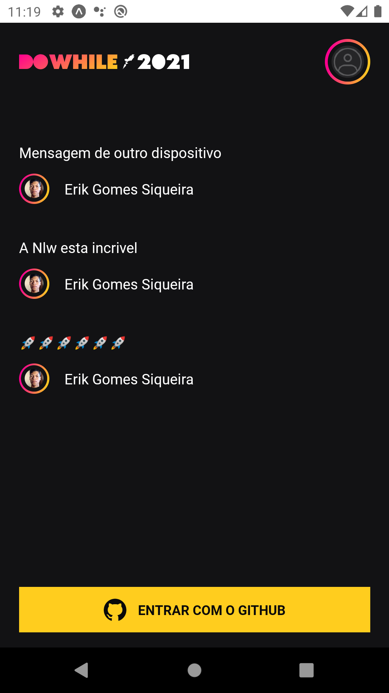
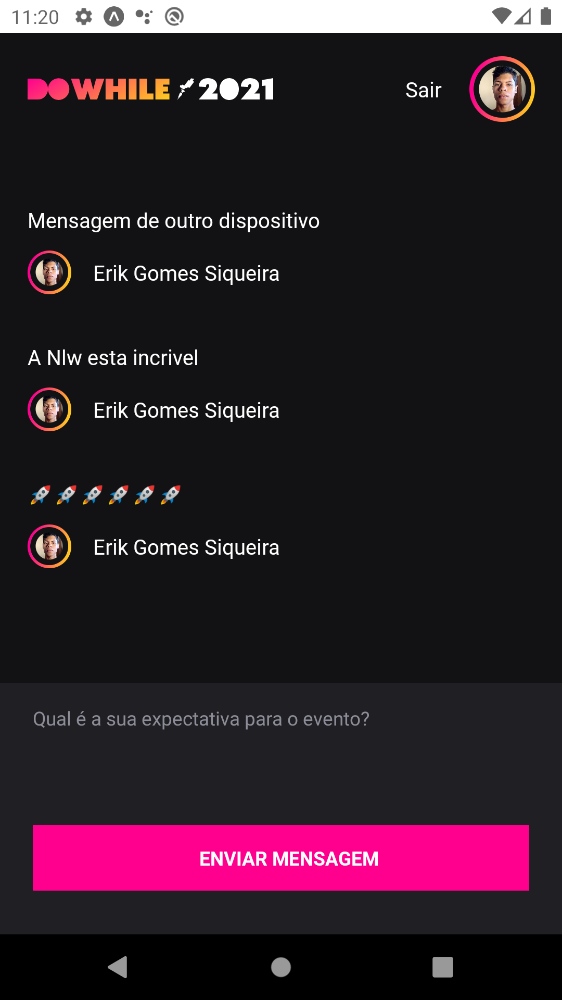

<h1 align="center"> 📱 NLW-Heat_React-Native ⚛ </h1>
 <p align="center">
    <i>Repositório aplicação desenvolvida no terceiro dia</i>
</p>

<br>

## ℹ Sobre a aplicação
<!--Aqui vai uma decrição breve-->

<p>
  Está aplicação foi a segunda desenvolvida durante o evento NLW Heat, ultimo NLW do ano de 2021 feito pela <a href="https://www.rocketseat.com.br/">Rocketseat</a>. Ela foi desenvolvida usando React Native, Expo e a linguagem de programação TypeScript, além delas foram utilizados o Socket.IO para comunicação em tempo real, Moti para aminações e varias outras tecnologias. Essa aplicação é uma continuação da primeira e uma opção mobile da segunda, por isso se aindanão viu o NLW-Heat_Node veja, ela será necessária(<a href="https://github.com/erikgomessiqueira/NLW-Heat_Node">Repositório NLW-Heat_Node</a>). Seu objetivo é:
</p>
<ul>
  <li>Obter o code para o login</li>
  <li>Logar com o GitHub</li>
  <li>Fornecer o Front-end para eviar e visualizar as mensagens</li>
  <li>Se integrar ao Back-end e usar suas rotas para fazer as requisições e envios</li>
</ul>

<br>

## 🎴 Layout
### 		🖌 [Protótipo](https://www.figma.com/file/PoLst4irj2fmDAnwGcoC64/%5BNLW-Heat---Mission%3A-Impulse%5D-DoWhile2021-(Community)/duplicate)
<br>

<div>
  <p align="center">
    <div>
      
      
      
    </div>
  </p>
</div>


<br>

## ⚙ Dependências
  - Git
  - Node
  - Yarn
  - [NLW-Heat_Node](https://github.com/erikgomessiqueira/NLW-Heat_Node)

<br>

## 🛠 Ferramentas
  - [TypeScript](https://www.typescriptlang.org/)
  - [Expo](https://docs.expo.dev/)
      - [Google-fonts ](https://docs.expo.dev/guides/using-custom-fonts/#using-a-google-font)
      - [AppLoaded](https://docs.expo.dev/versions/latest/sdk/app-loading/)
      - [react-native-svg](https://docs.expo.dev/versions/latest/sdk/svg/)
      - [LinearGradient](https://docs.expo.dev/versions/latest/sdk/linear-gradient/)
      - [react-native-svg-transformer](https://github.com/kristerkari/react-native-svg-transformer)
      - [react-native-iphone-x-helper](https://www.npmjs.com/package/react-native-iphone-x-helper)
      - 
  - [Axios](https://axios-http.com/)
  - [Socket.io-client](https://socket.io/docs/v4/client-api/)
  - [Moti](https://moti.fyi/)
  - [AuthSession](https://docs.expo.dev/versions/latest/sdk/auth-session/)
  - [AsyncStorage](https://docs.expo.dev/versions/latest/sdk/async-storage/)

<br>

## ▶❔ Como executar
   ### Clone o repositório
  ```bash
    $ git clone https://github.com/erikgomessiqueira/NLW-Heat_React-JS.git
  ```
  <br/>

  ### Instale as Dependências

  Instale com yarn ou npm:
  ```bash
    yarn install
  ```
  <br/>

### Crie uma aplicação no OAuth no GitHub

#### 1. Expo 

Para fazer isso é necessário ter uma conta no Site do [Expo](http://expo.dev/), devemos cobter nosso username da conta,  acessando o Perfil ⇒ Configurações ⇒ Membros ⇒ abaixo de Dono da conta (**@User_name**) 

####  2. App.json

Precisamos obter o nome da aplicação no arquivo na pasta raiz em app.json na propriedade name(**App123**).

####  3. URL

Precisamos montar uma URL que usaremos no aplicativo, que tem a seguinte sintaxe: `https://auth.expo.io/@User_name/App123`

####  4. GitHub

Acesse Settings => Developer Settings => OAuth Apps e crie uma nova aplicação `New OAuth App`.

Nomeie a aplicação `NLW-Heat_React-Native`.

Nos campos `Homepage URL` e `Authorization callback URL` use a URL criada no Item 3: `https://auth.expo.io/@User_name/App123`

Resgistre a aplicação.

Agora temos como pegar o valor Client ID e setar na constante `CLIENT_ID` no arquivo auth.tsx (./src/hooks/auth.tsx).

#### 5. NLW-Heat_Node

Se anida não clonou e configurou o servidor do [Repositório NLW-Heat_Node](https://github.com/erikgomessiqueira/NLW-Heat_Node), faça isso, ele é um requisito para a aplicação funcionar.  Tudo qui será feito nas configurações dele.

 No arquivo .env Mude GITHUB_CLIENT_SECRET para o valor de `Client secrets` e sete o valor do `CLIENT_ID`  para  GITHUB_CLIENT_ID. Use os dados do OAuth App que criamos para o aplicativo no item 4.

#### 6. URL Base

Acesse o arquivo api.ts (./src/services/api.ts) e mude a baseURL, você precisa ter o IP da sua máquina (Ex: 192.168.0.0) e montar ela da seguinte forma:

`http://192.168.0.0:4000`, ou seja, `http://IP/4000`

#### 6. Logar com Expo no terminal

Você deve esta com o termina logado com o expo, para que tudo de certo, para isso rode o comando `expo login`  e preencha os dados corretamente.   

<br/>

## ▶ Executando a aplicação

  ### Servidor
  Entre na pasta raiz do clone do [NLW-Heat_Node](https://github.com/erikgomessiqueira/NLW-Heat_Node) já configurado e execute o servidor(na sua documentação tambem ensina como executá-lo)

  <br/>

  ### Mobile
  Entre na pasta raiz do clone da aplicação **NlwHeatApp** já configurada e execute o comando:
  ```bash
  expo start 
  ```
  <br/>

  😁 Contribuindo ao projeto
   > [Guia de como contribuir no GitHub](https://github.com/firstcontributions/first-contributions)
   > <br>